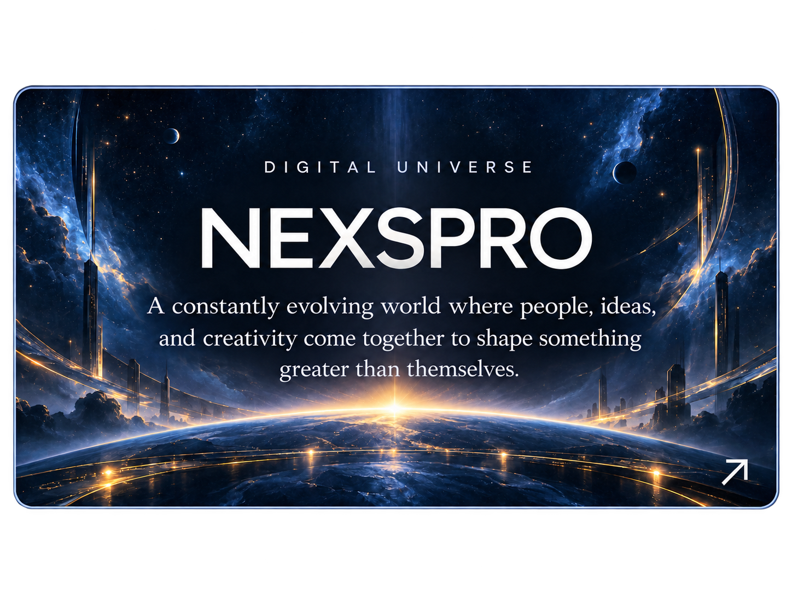
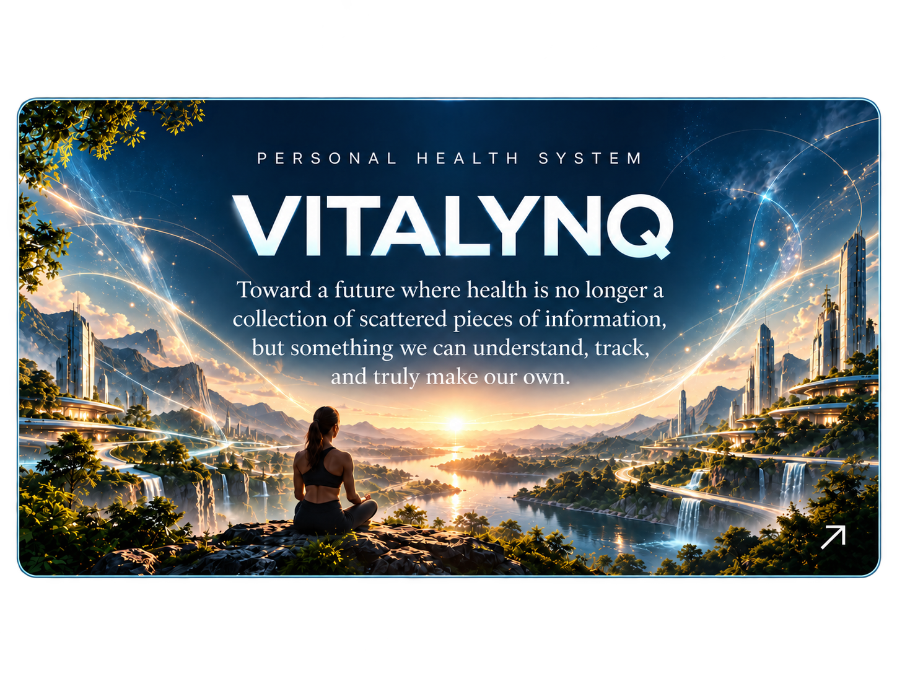
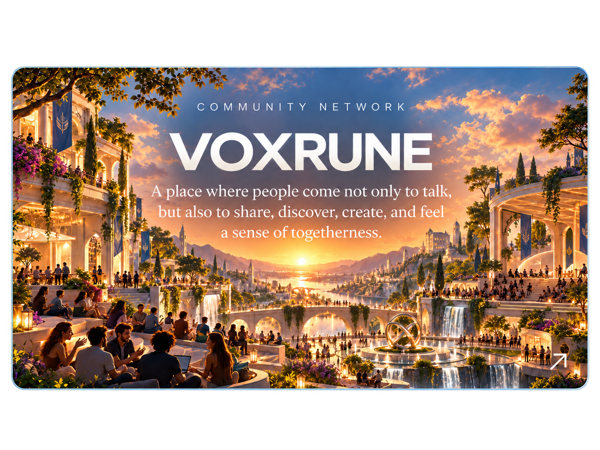
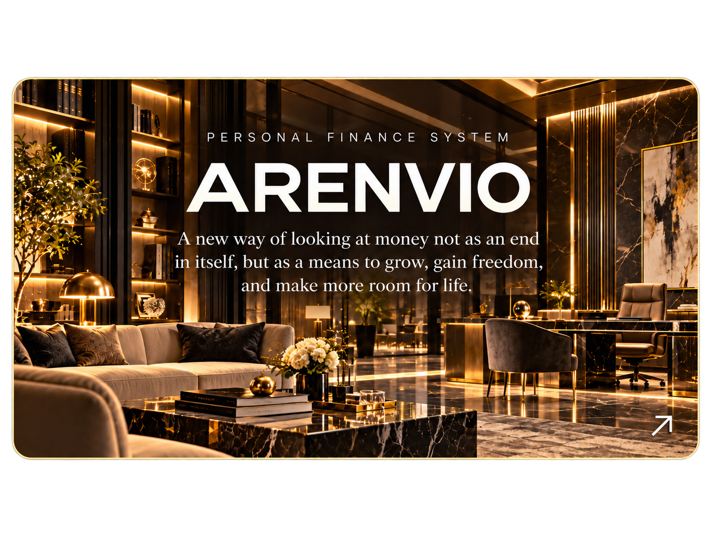

<h1 align="center">It all starts with a question.</h1>

 

  I’m drawn to ideas that are still incomplete. 
  The kind that make you wonder what they might become 
  if you stick with them long enough.

 

  I like to understand things deeply, to question what already exists, 
  and to create my own answer when the one that seems obvious isn’t enough.

 

<h3 align="center">Ideas that I’ve decided to put into practice.</h3>

  

  
  &nbsp;
  

 

  
  &nbsp;
  

